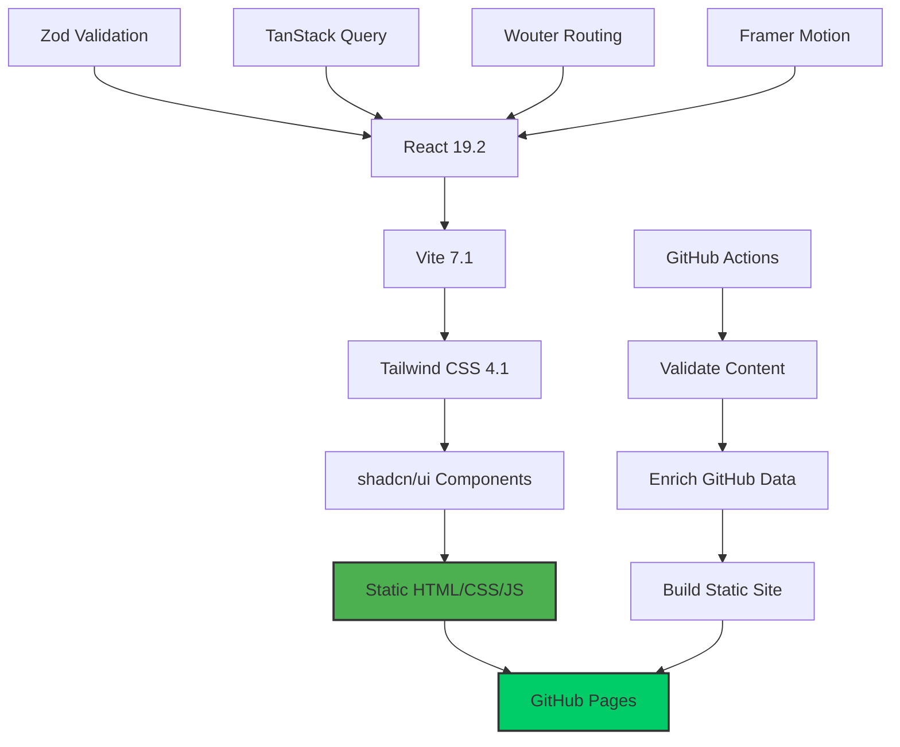
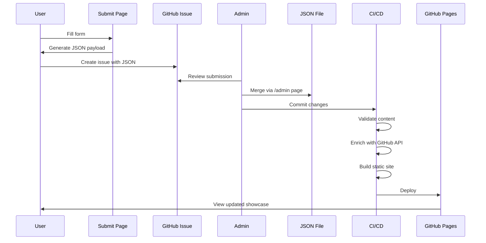
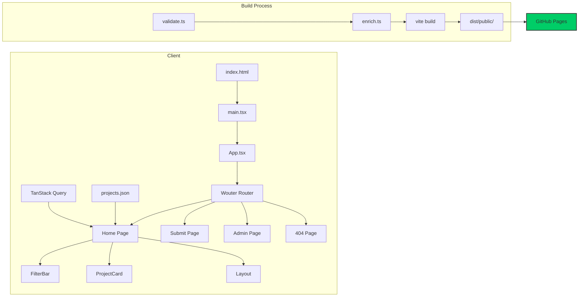
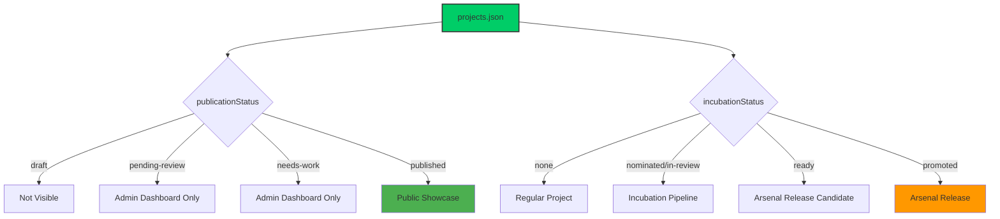
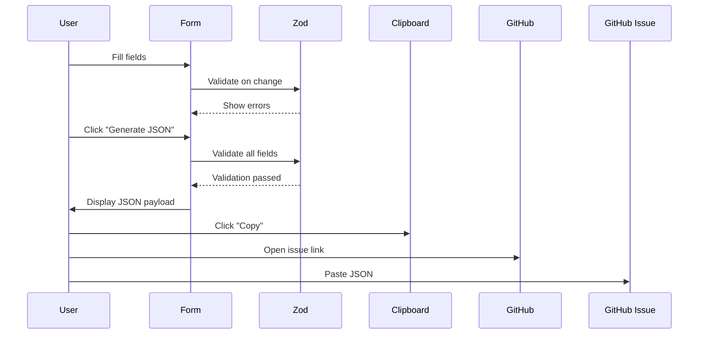
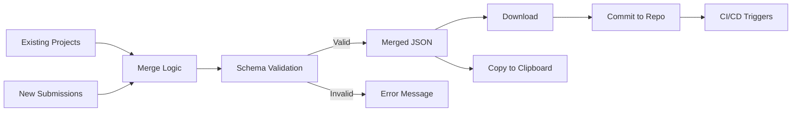
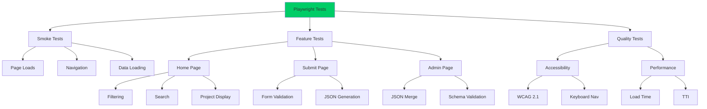
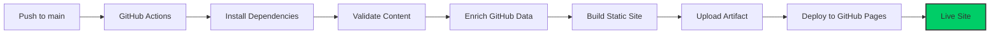

# GoCortex Showcase

A static site for showcasing Palo Alto Networks Cortex ecosystem projects with GitHub integration and administrative tools.

[](https://github.com/[username]/pilot-gocortexio-showcase/actions)
[](https://github.com/[username]/pilot-gocortexio-showcase/actions)

**Live Site:** `https://[username].github.io/[repo-name]/`

---

## Table of Contents

- [Overview](#overview)
- [Architecture](#architecture)
- [Directory Structure](#directory-structure)
- [Page Routes](#page-routes)
- [Getting Started](#getting-started)
- [Development](#development)
- [Testing](#testing)
- [Deployment](#deployment)
- [Project Submission](#project-submission)
- [Contributing](#contributing)

---

## Overview

**GoCortex Showcase** is a pure client-side static site that displays a curated collection of Cortex ecosystem projects. The site features:

- 🎨 **Modern UI** - Cyberpunk-themed design with Tailwind CSS
- 🔍 **Advanced Filtering** - Search by product, theatre, author, usecase, and period
- 📊 **GitHub Integration** - Live GitHub stats (stars, forks, last updated)
- 📝 **Project Submission** - Form-based submission workflow
- 🛠️ **Admin Tools** - JSON merge utility for managing projects
- ✅ **Comprehensive Testing** - 65+ Playwright tests
- 🚀 **GitHub Pages Deployment** - Automatic CI/CD pipeline

---

## Architecture

### Tech Stack



### Data Flow



### Application Architecture



---

## Unified Data Model

### Single Source of Truth

All projects, submissions, and showcase entries are **stored in one place**: `client/public/projects.json`. This eliminates data silos and ensures consistency.



### Project Lifecycle

Projects flow through these states:

1. **Draft** (`publicationStatus: "draft"`) - Initial creation, not visible anywhere
2. **Pending Review** (`publicationStatus: "pending-review"`) - Submitted for admin review
3. **Needs Work** (`publicationStatus: "needs-work"`) - Admin requested changes
4. **Published** (`publicationStatus: "published"`, `status: "active"`) - Live on showcase

Separately, projects can enter the **Incubation Pipeline**:

1. **Nominated** (`incubationStatus: "nominated"`) - Nominated for promotion
2. **In Review** (`incubationStatus: "in-review"`) - Being evaluated
3. **Ready** (`incubationStatus: "ready"`, `maturityScore ≥ 85`) - Ready for Arsenal
4. **Promoted** (`incubationStatus: "promoted"`) - Included in Arsenal release

### Data Consistency

- **Total Projects** = All records in `projects.json`
- **Total Submissions** = Same as total projects (unified)
- **Showcase Projects** = Projects with `publicationStatus === "published"`
- **Admin Dashboard** = Sees all projects, filtered by `publicationStatus`
- **Incubation Projects** = Projects with `incubationStatus !== "none"`

This design ensures:
- ✅ No duplicate records
- ✅ Single point of update
- ✅ Consistent statistics across all views
- ✅ Clear project lifecycle tracking

---

## Directory Structure

```
pilot-gocortexio-showcase/
├── .github/
│   └── workflows/
│       ├── deploy.yaml              # GitHub Pages deployment
│       ├── test.yaml                # Playwright tests
│       └── verify-dev-server.yaml   # Dev server verification
│
├── client/                          # Frontend application root
│   ├── public/                      # Static assets
│   │   ├── projects.json            # ⭐ Project database (source of truth)
│   │   ├── opengraph.png            # Social media preview
│   │   └── favicon.png              # Site favicon
│   │
│   ├── src/
│   │   ├── pages/                   # Route components
│   │   │   ├── home.tsx             # / - Main showcase
│   │   │   ├── submit.tsx           # /submit - Project submission
│   │   │   ├── admin.tsx            # /admin - JSON merge utility
│   │   │   └── not-found.tsx        # /* - 404 page
│   │   │
│   │   ├── components/
│   │   │   ├── layout.tsx           # Global layout wrapper
│   │   │   ├── filter-bar.tsx       # Advanced filtering UI
│   │   │   ├── project-card.tsx     # Project display card
│   │   │   └── ui/                  # 40+ shadcn/ui components
│   │   │       ├── button.tsx
│   │   │       ├── card.tsx
│   │   │       ├── dialog.tsx
│   │   │       └── ... (37+ more)
│   │   │
│   │   ├── hooks/
│   │   │   ├── use-toast.tsx        # Toast notifications
│   │   │   └── use-mobile.tsx       # Mobile detection
│   │   │
│   │   ├── lib/
│   │   │   ├── types.ts             # ⭐ Zod schemas & TypeScript types
│   │   │   ├── queryClient.ts       # TanStack Query config
│   │   │   └── utils.ts             # Utility functions (cn, etc.)
│   │   │
│   │   ├── App.tsx                  # ⭐ Router setup
│   │   ├── main.tsx                 # React entry point
│   │   └── index.css                # ⭐ Global styles & theme
│   │
│   └── index.html                   # HTML entry point
│
├── scripts/                         # Build-time scripts
│   ├── validate.ts                  # Content safety & dead link checks
│   └── enrich.ts                    # GitHub API data enrichment
│
├── tests/                           # Playwright E2E tests
│   ├── smoke.spec.ts                # Critical path (@smoke)
│   ├── home.spec.ts                 # Home page & filtering
│   ├── submit.spec.ts               # Form validation
│   ├── admin.spec.ts                # JSON merge utility
│   ├── accessibility.spec.ts        # A11y compliance
│   ├── performance.spec.ts          # Performance metrics
│   └── README.md                    # Testing guide
│
├── Dockerfile                       # Docker build config
├── nginx.conf                       # Nginx static hosting
├── vite.config.ts                   # ⭐ Vite build config
├── playwright.config.ts             # Playwright test config
├── tsconfig.json                    # TypeScript config
├── tailwind.config.js               # Tailwind CSS config
├── package.json                     # Dependencies & scripts
│
├── CLAUDE.md                        # AI assistant guide
├── BACKEND_ARCHITECTURE.md          # Backend implementation guide
├── DEV_SERVER_SETUP.md              # Dev server verification
├── IMPLEMENTATION_SUMMARY.md        # Recent changes summary
└── README.md                        # This file

⭐ = Critical files for understanding the project
```

### Key Directories Explained

| Directory | Purpose | Key Files |
|-----------|---------|-----------|
| `client/src/pages/` | Route components (one per URL) | `home.tsx`, `submit.tsx`, `admin.tsx` |
| `client/src/components/` | Reusable UI components | `filter-bar.tsx`, `project-card.tsx` |
| `client/src/components/ui/` | shadcn/ui primitives | 40+ components |
| `client/src/lib/` | Types, schemas, utilities | `types.ts` (Zod schemas) |
| `client/public/` | Static assets | `projects.json` (database) |
| `scripts/` | Build-time utilities | `validate.ts`, `enrich.ts` |
| `tests/` | Playwright test suites | 6 test files |
| `.github/workflows/` | CI/CD pipelines | `deploy.yaml`, `test.yaml` |

---

## Page Routes

### Route Mapping

```mermaid
graph LR
    A[/ Root] --> B[home.tsx]
    C[/submit] --> D[submit.tsx]
    E[/admin] --> F[admin.tsx]
    G[/* 404] --> H[not-found.tsx]

    B --> I[FilterBar Component]
    B --> J[ProjectCard Component]
    B --> K[Layout Component]

    D --> L[React Hook Form]
    D --> M[Zod Validation]

    F --> N[JSON Editor Panels]
    F --> O[Merge Logic]

    style B fill:#4CAF50
    style D fill:#2196F3
    style F fill:#FF9800
    style H fill:#F44336
```

### Page Details

#### 1. **Home** (`/`) - `client/src/pages/home.tsx`
**Purpose:** Main project showcase with advanced filtering

**Features:**
- Grid of project cards with animations
- Search bar (fuzzy search across name, description, author)
- 5 filter dropdowns:
  - Product (Cortex XSIAM, XDR, XSOAR, Prisma Cloud, Strata)
  - Theatre (NAM, JAPAC, EMEA, LATAM, Global)
  - Author (dynamic list)
  - Usecase (dynamic list)
  - Period (filter by date range)
- Loading states
- Empty/no results states
- GitHub stats display (stars, forks, last updated)

**Data Flow:**
```
projects.json → TanStack Query → useState → FilterBar + ProjectCard Grid
```

**Components Used:**
- `<FilterBar />` - Advanced filtering UI
- `<ProjectCard />` - Individual project display
- `<Layout />` - Header/footer wrapper

---

#### 2. **Submit** (`/submit`) - `client/src/pages/submit.tsx`
**Purpose:** Project submission form with JSON generation

**Features:**
- Multi-field form (React Hook Form + Zod)
- Required fields: name, description, link, author, language
- Optional fields: repo, product, theatre, usecase, status
- Real-time validation
- JSON payload generation
- Copy to clipboard
- Opens GitHub Issue with payload

**Form Flow:**


**Validation Rules:**
- Name: Required, min 1 char
- Description: Required, min 10 chars
- Link: Required, valid URL
- Repo: Optional, format `owner/repo`
- Date: Auto-filled with current date (YYYY-MM-DD)

---

#### 3. **Admin** (`/admin`) - `client/src/pages/admin.tsx`
**Purpose:** Unified project management dashboard

**Features:**
- **Dashboard Overview** - Stats cards showing pending, needs work, incubation, and published counts
- **Submission Review** - Manage projects by publication status (draft, pending-review, needs-work, published)
- **Incubation Pipeline** - Track projects being promoted to Arsenal release
- **Arsenal Release Builder** - Create versioned Arsenal releases
- **Announcements** - Create markdown announcements with diagram support
- **Expandable Project Details** - View full project metadata in submission cards
- **Action Handlers** - Approve, reject, or request changes on submissions
- No authentication (client-side only, manual JSON updates)

**Workflow:**


**Validation:**
- JSON syntax check
- Zod schema validation
- Duplicate detection (by name)
- Required fields enforcement

---

#### 4. **404 Not Found** (`/*`) - `client/src/pages/not-found.tsx`
**Purpose:** Error page for invalid routes

**Features:**
- "404 - Page Not Found" message
- Link back to home page
- Simple design consistent with theme

---

## Getting Started

### Prerequisites

Check that you have the required software:

```bash
# Check Node.js version (need 20+)
node --version

# Check npm version (need 9+)
npm --version

# Check git
git --version
```

**Required:**
- **Node.js** 20+ (LTS recommended) - [Download here](https://nodejs.org/)
- **npm** 9+ (comes with Node.js)
- **Git** - [Download here](https://git-scm.com/)

**Optional:**
- **Playwright** (for testing) - Installed in step 3 below

### Installation

#### Step 1: Clone Repository

```bash
# HTTPS (recommended for read access)
git clone https://github.com/[username]/pilot-gocortexio-showcase.git
cd pilot-gocortexio-showcase

# OR SSH (if you have SSH keys configured)
git clone git@github.com:[username]/pilot-gocortexio-showcase.git
cd pilot-gocortexio-showcase
```

#### Step 2: Install Dependencies

```bash
# Install all npm packages (takes 1-2 minutes)
npm install
```

**Expected output:**
```
added 1200+ packages in 45s
```

If you see errors here, see [Troubleshooting](#troubleshooting) section below.

#### Step 3: Install Playwright (Optional - for testing only)

```bash
# Install Playwright browsers (takes 2-3 minutes)
npx playwright install

# OR install with system dependencies
npx playwright install --with-deps
```

**Skip this step if you only want to run the dev server.**

### Quick Start

#### Start Development Server

```bash
# CLIENT ONLY - NO BACKEND EXISTS
npm run dev:client
```

**Expected output:**
```
  VITE v7.1.12  ready in 155 ms

  ➜  Local:   http://localhost:5173/
  ➜  Network: http://192.168.1.x:5173/
```

#### Open in Browser

Navigate to [http://localhost:5173](http://localhost:5173)

You should see:
- ✅ GoCortex Showcase homepage
- ✅ Grid of project cards
- ✅ Navigation header
- ✅ Filter bar

---

### ⚠️ CRITICAL: Common Mistake

**❌ DO NOT RUN:**
```bash
npm run dev  # This will FAIL - no backend exists
```

**Error you'll see:**
```
[server] Error: Cannot find module 'server/index.ts'
```

**✅ ALWAYS USE:**
```bash
npm run dev:client  # This works - client-side only
```

**Why?**
- This is a **pure static site** (no Express server, no database, no backend API)
- The `npm run dev` script is leftover from a template and tries to start a non-existent server
- All data comes from `client/public/projects.json` loaded in the browser

---

### Verify Installation

#### Test 1: Dev Server Loads
```bash
# Start dev server
npm run dev:client

# In another terminal, test the server
curl http://localhost:5173
```

**Expected:** HTML content (not an error)

#### Test 2: Projects Load
```bash
# Check projects.json exists and is valid
cat client/public/projects.json | head -20
```

**Expected:** Valid JSON array with project objects

#### Test 3: TypeScript Compiles
```bash
# Run TypeScript compiler check
npm run check
```

**Expected:** No errors (or only errors in incubation-hub.tsx which is not used)

#### Test 4: Build Works
```bash
# Build production bundle
npm run build
```

**Expected:**
```
✓ built in 4.96s
✅ Build completed successfully!
```

#### Test 5: Run Smoke Tests (Optional)
```bash
# Quick smoke test suite
npm run test:smoke
```

**Expected:** All tests pass (takes < 2 minutes)

---

## Development

### Commands

```bash
# Development
npm run dev:client          # Start Vite dev server on port 5173

# Type Checking
npm run check               # Run TypeScript compiler check

# Testing
npm test                    # Run all Playwright tests
npm run test:ui             # Run tests with UI mode (recommended)
npm run test:smoke          # Run smoke tests only (fast)
npm run test:headed         # Run tests in headed mode
npm run test:debug          # Debug tests

# Production Build
npm run build               # Build static site

# Build Scripts (CI/CD only)
npx tsx scripts/validate.ts # Content safety + dead link checks
npx tsx scripts/enrich.ts   # Fetch GitHub API stats (requires GITHUB_TOKEN)
```

### Development Workflow

1. **Make changes** to files in `client/src/`
2. **Hot reload** happens automatically
3. **Run tests** with `npm run test:smoke`
4. **Commit changes** to trigger CI/CD

### Adding a New Project

#### Option 1: Via Submit Page (Recommended)
1. Navigate to `/submit`
2. Fill out the form
3. Click "Generate JSON"
4. Copy the JSON payload
5. Create a GitHub Issue with the payload
6. Admin reviews and merges via `/admin` page

#### Option 2: Manual Edit
1. Edit `client/public/projects.json`
2. Add your project to the array
3. Ensure it matches the schema (see `client/src/lib/types.ts`)
4. Commit and push

**Project Schema:**
```typescript
{
  // Core Fields
  name: string;              // Required
  description: string;       // Required, min 10 chars
  status: "active" | "development" | "beta" | "deprecated";
  link: string;              // Required, valid URL
  language: string;          // Required
  author: string;            // Required
  date: string;              // YYYY-MM-DD format

  // Optional Metadata
  repo?: string;             // Optional, "owner/repo" format
  githubApi: boolean;        // Enable GitHub API enrichment (default: false)
  product?: "Cortex XSIAM" | "Cortex XDR" | "Cortex XSOAR" | "Prisma Cloud" | "Strata";
  theatre?: "NAM" | "JAPAC" | "EMEA" | "LATAM" | "Global";
  usecase?: string;

  // Publication & Review (NEW - Unified Data Model)
  publicationStatus?: "draft" | "pending-review" | "needs-work" | "published";  // Default: "draft"
  submittedBy?: string;      // Email of submitter
  submittedAt?: string;      // ISO timestamp
  reviewNotes?: string;      // Admin feedback

  // Incubation Pipeline (NEW)
  incubationStatus?: "none" | "nominated" | "in-review" | "ready" | "promoted";  // Default: "none"
  maturityScore?: number;    // 0-100 readiness score
  promotionTarget?: "pre-sales" | "regional-nam" | "regional-emea" | "regional-japac" | "global";
  champion?: string;         // Project champion name

  // GitHub Enriched Data (auto-populated by CI/CD)
  stars?: number;
  forks?: number;
  lastUpdated?: string;
  license?: string;

  // Media
  media?: {
    type: "image" | "youtube";
    url: string;
    alt: string;
  };
}
```

### Modifying the UI

#### Update a Page
1. Edit `client/src/pages/[page-name].tsx`
2. Save and see changes in browser

#### Add a Component
1. Create `client/src/components/my-component.tsx`
2. Import in page: `import MyComponent from '@/components/my-component'`
3. Use: `<MyComponent />`

#### Update Styles
- Global styles: `client/src/index.css`
- Component styles: Tailwind classes in JSX
- Theme variables: `:root` in `client/src/index.css`

---

## Testing

### Test Suite Overview



### Running Tests

```bash
# Quick smoke test (< 2 minutes)
npm run test:smoke

# Full test suite (< 10 minutes)
npm test

# Interactive UI mode (recommended for debugging)
npm run test:ui

# Specific test file
npx playwright test tests/home.spec.ts

# Specific browser
npx playwright test --project=chromium
```

### Test Coverage

- **6 test suites** - `smoke`, `home`, `submit`, `admin`, `accessibility`, `performance`
- **65+ individual tests**
- **5 browsers** - Desktop Chrome, Firefox, Safari, Mobile Chrome, Mobile Safari
- **Quality gates** - A11y, performance, form validation, cross-browser

See [tests/README.md](tests/README.md) for detailed testing guide.

---

## Deployment

### GitHub Pages (Current)

**Automatic deployment** on push to `main` branch.

**Workflow:** `.github/workflows/deploy.yaml`



**Steps:**
1. ✅ **Validate** - Content safety check + dead link detection
2. ✅ **Enrich** - Fetch GitHub API stats (stars, forks, etc.)
3. ✅ **Build** - `vite build --base /$REPO_NAME/`
4. ✅ **Deploy** - Upload to GitHub Pages

**Configuration:**
- **Repository Settings** → **Pages** → **Source**: GitHub Actions
- **Custom domain**: Optional (configure in repo settings)
- **Base path**: Automatically set to `/$REPO_NAME/`

**Access your site:**
```
https://[username].github.io/[repo-name]/
```

### Alternative Deployments

#### Docker (Self-hosted)
```bash
# Build image
docker build -t gocortex-showcase .

# Run container
docker run -p 8080:80 gocortex-showcase

# Access at http://localhost:8080
```

See [Dockerfile](Dockerfile) and [BACKEND_ARCHITECTURE.md](BACKEND_ARCHITECTURE.md) for details.

#### Vercel / Netlify
1. Import repository
2. Build command: `npm run build`
3. Output directory: `dist/public`
4. Deploy

---

## Project Submission

### For Contributors

Want to add your Cortex project to the showcase?

#### Step 1: Prepare Your Project
Ensure your project:
- ✅ Is related to Palo Alto Networks Cortex ecosystem
- ✅ Has a public GitHub repository (recommended)
- ✅ Has a clear description (min 10 characters)
- ✅ Is safe for work (content safety checks enabled)

#### Step 2: Submit via Form
1. Go to `/submit` page
2. Fill in required fields:
   - **Project Name** - Official name
   - **Description** - What does it do? (min 10 chars)
   - **Link** - Project URL or repo
   - **Author** - Your name or team
   - **Language** - Primary programming language
3. Fill in optional fields:
   - **GitHub Repo** - `owner/repo` format (enables live stats)
   - **Product** - Which Cortex product?
   - **Theatre** - Geographic region
   - **Usecase** - What problem does it solve?
   - **Status** - Development stage
4. Click "Generate JSON"
5. Copy the JSON payload
6. Click "Open GitHub Issue"
7. Paste JSON into issue

#### Step 3: Wait for Review
- Admin reviews submission
- If approved, merged via `/admin` page
- Site automatically rebuilds and deploys
- Your project appears on the showcase!

### For Admins

#### Reviewing Submissions
1. Check GitHub Issues for new submissions
2. Verify JSON is valid
3. Check for appropriate content
4. Review GitHub repo (if provided)

#### Merging Submissions
1. Go to `/admin` page
2. Panel 1 shows existing projects (auto-loaded from `projects.json`)
3. Copy submission JSON from issue
4. Paste into Panel 2
5. Click "Merge"
6. Verify merged output
7. Click "Download" or "Copy"
8. Commit `projects.json` to repository
9. CI/CD automatically deploys updated site

---

## Contributing

### Development Setup
1. Fork the repository
2. Clone your fork
3. Create a feature branch: `git checkout -b feature/my-feature`
4. Make changes
5. Run tests: `npm run test:smoke`
6. Commit: `git commit -m "feat: add my feature"`
7. Push: `git push origin feature/my-feature`
8. Create Pull Request

### Code Style
- **TypeScript** - Strict mode enabled
- **ESLint** - Auto-formatting on save (recommended)
- **Tailwind CSS** - Utility-first approach
- **Component Structure** - Functional components with hooks

### Testing Requirements
- ✅ All smoke tests must pass
- ✅ Add tests for new features
- ✅ Maintain accessibility standards
- ✅ No console errors

### Commit Convention
- `feat:` - New feature
- `fix:` - Bug fix
- `docs:` - Documentation changes
- `style:` - Code style changes (formatting)
- `refactor:` - Code refactoring
- `test:` - Adding or updating tests
- `chore:` - Build process or tooling changes

---

## Configuration Files

### Key Configuration

| File | Purpose |
|------|---------|
| `vite.config.ts` | Vite build configuration, aliases, plugins |
| `tsconfig.json` | TypeScript compiler options |
| `playwright.config.ts` | Playwright test configuration |
| `tailwind.config.js` | Tailwind CSS customization |
| `package.json` | Dependencies, scripts, project metadata |
| `.github/workflows/deploy.yaml` | GitHub Pages deployment workflow |
| `.github/workflows/test.yaml` | Playwright test workflow |

### Environment Variables

**Build Time:**
- `GITHUB_TOKEN` - Required for GitHub API enrichment (auto-provided in CI/CD)
- `BASE_URL` - Optional, for Playwright tests (default: `http://localhost:5173`)

**No Runtime Environment Variables** - This is a static site

---

## Troubleshooting

### Installation Issues

#### Issue 1: `npm install` Fails

**Symptoms:**
```
npm ERR! code EINTEGRITY
npm ERR! sha512-... integrity checksum failed
```

**Solutions:**

```bash
# Solution A: Clear npm cache
npm cache clean --force
npm install

# Solution B: Delete lock file and reinstall
rm package-lock.json
npm install

# Solution C: Use different registry
npm install --registry https://registry.npmjs.org/

# Solution D: Update npm itself
npm install -g npm@latest
npm install
```

#### Issue 2: Node Version Too Old

**Symptoms:**
```
error This project requires Node.js >=20.0.0
```

**Solution:**

```bash
# Check current version
node --version

# Install Node 20+ from https://nodejs.org/
# OR use nvm (Node Version Manager)
nvm install 20
nvm use 20
node --version  # Should show v20.x.x
```

#### Issue 3: Permission Errors (macOS/Linux)

**Symptoms:**
```
npm ERR! Error: EACCES: permission denied
```

**Solutions:**

```bash
# Solution A: Fix npm permissions (recommended)
mkdir ~/.npm-global
npm config set prefix '~/.npm-global'
echo 'export PATH=~/.npm-global/bin:$PATH' >> ~/.bashrc
source ~/.bashrc

# Solution B: Use sudo (NOT recommended, but works)
sudo npm install

# Solution C: Fix node_modules ownership
sudo chown -R $USER:$GROUP ~/.npm
sudo chown -R $USER:$GROUP node_modules
```

---

### Development Server Issues

#### Issue 4: `npm run dev` Fails with "Cannot find module 'server/index.ts'"

**THIS IS EXPECTED!**

**Symptoms:**
```bash
npm run dev
# [server] Error: Cannot find module '/path/to/server/index.ts'
# [server] npm run dev:server exited with code 1
```

**Solution:**
```bash
# DON'T use npm run dev
# USE THIS INSTEAD:
npm run dev:client
```

**Why:** This is a pure client-side application. There is no backend server. The `npm run dev` script is broken and should not be used.

#### Issue 5: Port 5173 Already in Use

**Symptoms:**
```
Port 5173 is in use, trying another one...
```

**Solutions:**

```bash
# Solution A: Kill existing process (macOS/Linux)
lsof -ti:5173 | xargs kill -9

# Solution B: Kill existing process (Windows)
netstat -ano | findstr :5173
taskkill /PID <PID> /F

# Solution C: Use different port
npm run dev:client -- --port 3000

# Solution D: Check what's using the port
lsof -i:5173  # macOS/Linux
netstat -ano | findstr :5173  # Windows
```

#### Issue 6: Browser Shows "Cannot GET /"

**Symptoms:**
- Dev server starts but browser shows blank page or error
- Console shows 404 errors

**Solutions:**

```bash
# Check if index.html exists
ls client/index.html

# Restart dev server with clearing cache
rm -rf client/.vite
npm run dev:client

# Check Vite config
cat vite.config.ts | grep root
# Should show: root: 'client'
```

#### Issue 7: Hot Reload Not Working

**Symptoms:**
- Changes to files don't show in browser
- Need to manually refresh

**Solutions:**

```bash
# Solution A: Restart dev server
# Press Ctrl+C, then run again
npm run dev:client

# Solution B: Clear Vite cache
rm -rf node_modules/.vite
npm run dev:client

# Solution C: Check file watchers (Linux)
# Increase inotify watches limit
echo fs.inotify.max_user_watches=524288 | sudo tee -a /etc/sysctl.conf
sudo sysctl -p
```

---

### Build Issues

#### Issue 8: TypeScript Errors on Build

**Symptoms:**
```bash
npm run check
# client/src/pages/incubation-hub.tsx(24,9): error TS2769
```

**Solution:**

These errors are **EXPECTED** in `incubation-hub.tsx` which is not currently used. To verify only critical files:

```bash
# Check main files compile
npx tsc --noEmit client/src/pages/home.tsx
npx tsc --noEmit client/src/pages/admin.tsx
npx tsc --noEmit client/src/pages/submit.tsx

# Full build should still work
npm run build
```

#### Issue 9: Build Fails with Memory Error

**Symptoms:**
```
FATAL ERROR: Reached heap limit Allocation failed
```

**Solutions:**

```bash
# Solution A: Increase Node memory
NODE_OPTIONS="--max-old-space-size=4096" npm run build

# Solution B: Clear all caches
rm -rf node_modules dist client/.vite
npm install
npm run build
```

#### Issue 10: Vite Build Fails

**Symptoms:**
```
Error: Failed to parse source for import analysis
```

**Solutions:**

```bash
# Solution A: Update Vite
npm install vite@latest --save-dev
npm run build

# Solution B: Clear dist and rebuild
rm -rf dist
npm run build

# Solution C: Check vite.config.ts syntax
npm run check
```

---

### Testing Issues

#### Issue 11: Playwright Tests Fail

**Symptoms:**
```bash
npm test
# Error: browserType.launch: Executable doesn't exist
```

**Solutions:**

```bash
# Solution A: Install Playwright browsers
npx playwright install

# Solution B: Install with system dependencies
npx playwright install --with-deps

# Solution C: Install specific browser
npx playwright install chromium

# Solution D: Check Playwright version
npx playwright --version
npm list @playwright/test
```

#### Issue 12: Tests Timeout

**Symptoms:**
```
Timeout of 30000ms exceeded
```

**Solutions:**

```bash
# Solution A: Increase timeout in playwright.config.ts
# Edit timeout: 60000

# Solution B: Run with more time
npx playwright test --timeout=60000

# Solution C: Run only smoke tests
npm run test:smoke

# Solution D: Run with debug
npm run test:debug
```

#### Issue 13: Tests Can't Connect to Dev Server

**Symptoms:**
```
Error: page.goto: net::ERR_CONNECTION_REFUSED
```

**Solutions:**

```bash
# Solution A: Ensure dev server is running
# In one terminal:
npm run dev:client

# In another terminal:
npm test

# Solution B: Check port in playwright.config.ts
# Should match: use: { baseURL: 'http://localhost:5173' }

# Solution C: Wait for dev server to be ready
# Give it 10-15 seconds after starting
```

---

### Data & Content Issues

#### Issue 14: Projects Not Loading

**Symptoms:**
- Homepage shows "No projects found"
- Console error: "Failed to fetch"

**Solutions:**

```bash
# Solution A: Check projects.json exists and is valid
cat client/public/projects.json | python3 -m json.tool

# Solution B: Check projects.json is not empty
wc -l client/public/projects.json
# Should be > 10 lines

# Solution C: Validate JSON syntax
npx jsonlint client/public/projects.json

# Solution D: Check file permissions
ls -la client/public/projects.json
# Should be readable (644 or similar)
```

#### Issue 15: Images Not Loading

**Symptoms:**
- Project cards show broken image icons
- 404 errors in console for images

**Solutions:**

```bash
# Check image path in projects.json
# Images should be in client/public/ or external URLs

# For local images:
ls client/public/*.png
ls client/public/images/*.png

# Update projects.json with correct paths:
# "media": { "url": "/image.png" }  # For files in public/
# "media": { "url": "https://..." }  # For external images
```

---

### GitHub Deployment Issues

#### Issue 16: GitHub Pages Not Updating

**Symptoms:**
- Pushed to main but site doesn't update
- Changes not visible after deployment

**Solutions:**

```bash
# Step 1: Check GitHub Actions workflow
# Go to: https://github.com/[user]/[repo]/actions
# Look for failed workflows (red X)

# Step 2: Check workflow logs
# Click on failed workflow → View details
# Common errors:
#   - "No GITHUB_TOKEN" → Check repo permissions
#   - "Build failed" → Check error logs
#   - "Deploy failed" → Check Pages settings

# Step 3: Verify Pages is enabled
# Settings → Pages → Source: GitHub Actions

# Step 4: Clear browser cache
# Chrome: Ctrl+Shift+R (force reload)
# Or: Open in incognito/private mode

# Step 5: Wait for CDN propagation
# Can take 1-5 minutes for changes to appear
```

#### Issue 17: GitHub Actions Workflow Fails

**Symptoms:**
```
Run npm run build
Error: Command failed with exit code 1
```

**Solutions:**

```bash
# Step 1: Test build locally
npm run build
# Fix any errors that appear

# Step 2: Check if GITHUB_TOKEN is needed
# For GitHub API enrichment, ensure:
# - Workflow has: permissions: contents: read

# Step 3: Check Node version in workflow
# .github/workflows/deploy.yaml should have:
# - uses: actions/setup-node@v4
#   with:
#     node-version: '20'

# Step 4: Check if workflow file is valid
npx yaml-lint .github/workflows/deploy.yaml
```

---

### Performance Issues

#### Issue 18: Slow Build Times

**Symptoms:**
- Build takes > 5 minutes
- High CPU/memory usage

**Solutions:**

```bash
# Solution A: Clear caches
rm -rf node_modules/.vite dist
npm run build

# Solution B: Disable source maps (faster builds)
# Edit vite.config.ts:
# build: { sourcemap: false }

# Solution C: Reduce concurrent operations
# Edit vite.config.ts:
# build: { rollupOptions: { maxParallelFileOps: 2 } }

# Solution D: Check for circular dependencies
npx madge --circular client/src
```

#### Issue 19: Large Bundle Size

**Symptoms:**
```
(!) Some chunks are larger than 500 kB after minification
```

**This is a WARNING, not an error.**

**To optimize:**

```bash
# Analyze bundle
npm run build
# Check dist/public/assets/*.js file sizes

# Solution A: Enable code splitting
# Already configured in vite.config.ts

# Solution B: Lazy load heavy components
# Use React.lazy() for large pages

# Solution C: Check bundle composition
npx vite-bundle-visualizer
```

---

### Getting Help

If none of these solutions work:

1. **Check existing issues**: [GitHub Issues](https://github.com/[username]/pilot-gocortexio-showcase/issues)
2. **Create new issue**: Include error messages, OS, Node version, steps to reproduce
3. **Review documentation**: See [CLAUDE.md](CLAUDE.md) for development guidelines
4. **Check workflows**: Look at [.github/workflows/](.github/workflows/) for CI/CD configs

**Useful Debug Commands:**

```bash
# System info
node --version
npm --version
npx playwright --version

# Project info
npm list --depth=0
git status
git log --oneline -5

# Check file structure
ls -la client/public/
ls -la client/src/pages/

# Check running processes
lsof -i:5173  # macOS/Linux
netstat -ano | findstr :5173  # Windows
```

---

## Resources

### Documentation
- [CLAUDE.md](CLAUDE.md) - AI assistant guide for development
- [BACKEND_ARCHITECTURE.md](BACKEND_ARCHITECTURE.md) - Backend implementation guide
- [DEV_SERVER_SETUP.md](DEV_SERVER_SETUP.md) - Dev server verification
- [tests/README.md](tests/README.md) - Testing guide
- [IMPLEMENTATION_SUMMARY.md](IMPLEMENTATION_SUMMARY.md) - Recent changes

### External Links
- [Vite Documentation](https://vite.dev/)
- [React Documentation](https://react.dev/)
- [Tailwind CSS](https://tailwindcss.com/)
- [Playwright](https://playwright.dev/)
- [shadcn/ui](https://ui.shadcn.com/)

---

## Security

[](https://github.com/simonsigre/pilot-gocortexio-showcase/actions/workflows/security-audit.yaml)

### Security Measures

- ✅ **Dependabot:** Enabled - Weekly dependency scans
- ✅ **Secret Scanning:** Enabled
- ✅ **NPM Audit:** 0 vulnerabilities
- ✅ **HTTPS:** Enforced via GitHub Pages/Kubernetes
- ✅ **CSP Headers:** Configured in nginx
- ✅ **Data Backups:** Automated daily backups
- ✅ **Disaster Recovery:** Documented procedures

### Reporting Vulnerabilities

**⚠️ DO NOT open public issues for security vulnerabilities.**

See [SECURITY.md](./SECURITY.md) for our security policy and how to report vulnerabilities.

### Related Documentation

- [SECURITY.md](./SECURITY.md) - Security policy and vulnerability reporting
- [DISASTER_RECOVERY.md](./DISASTER_RECOVERY.md) - Data recovery procedures
- [GAP_CLOSURE_PLAN.md](./GAP_CLOSURE_PLAN.md) - Production readiness plan
- [MVP_GAP_ANALYSIS.md](./MVP_GAP_ANALYSIS.md) - Gap analysis for MVP release

---

## License

MIT License - See [LICENSE](LICENSE) file for details

---

## Support

- **Issues**: [GitHub Issues](https://github.com/[username]/pilot-gocortexio-showcase/issues)
- **Discussions**: [GitHub Discussions](https://github.com/[username]/pilot-gocortexio-showcase/discussions)
- **Pull Requests**: [GitHub PRs](https://github.com/[username]/pilot-gocortexio-showcase/pulls)

---

**Built with ❤️ for the Palo Alto Networks Cortex community**
