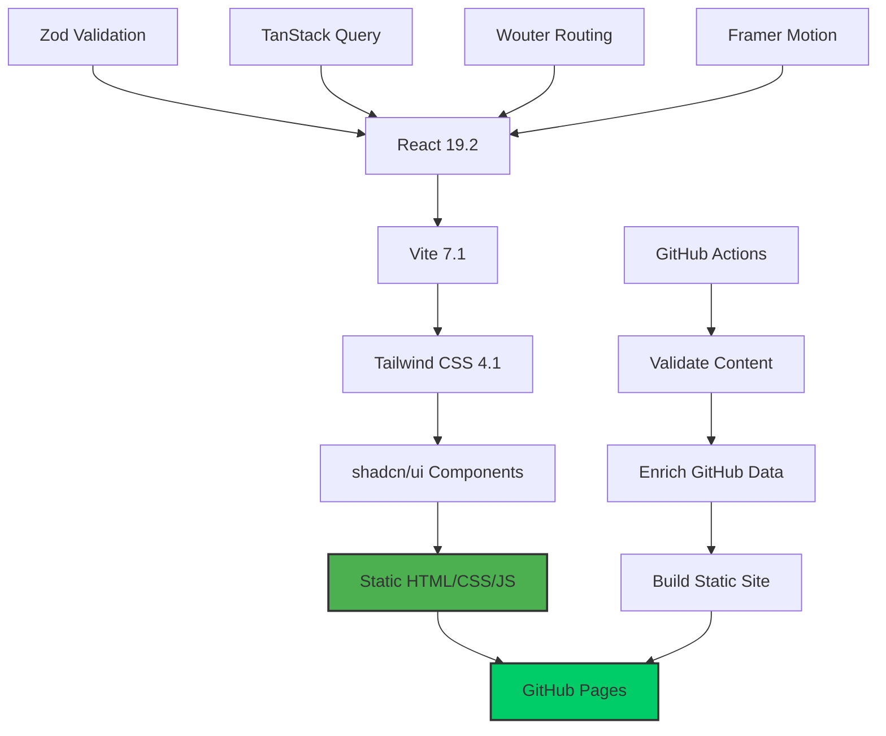
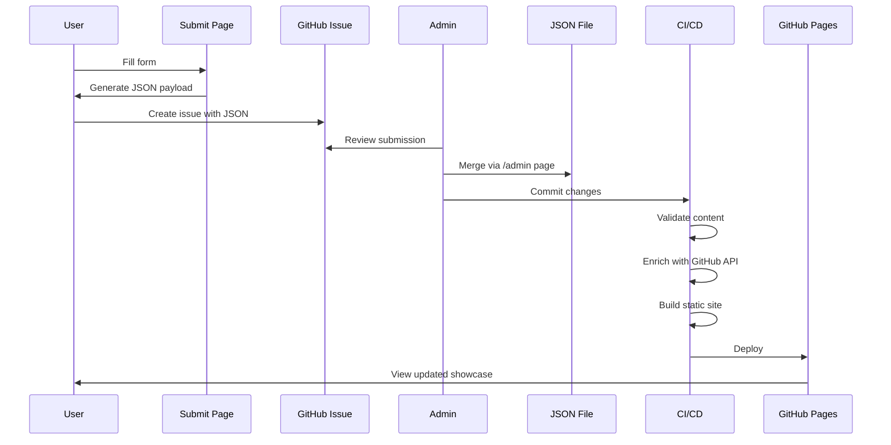
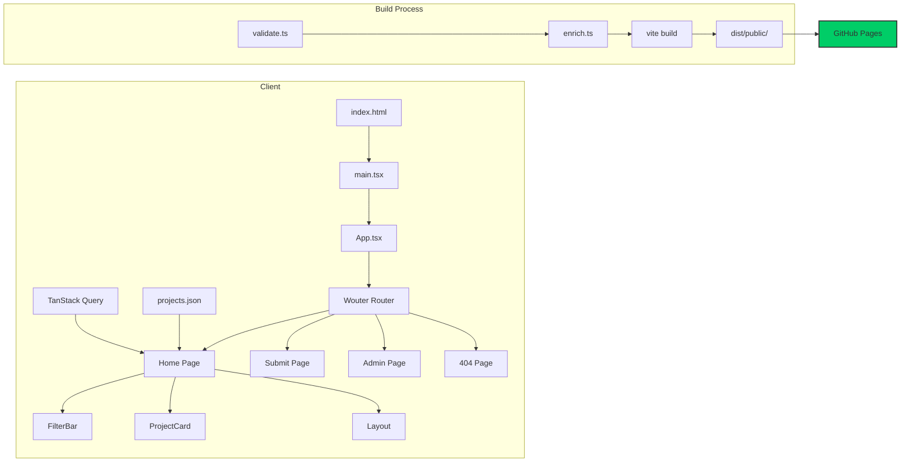
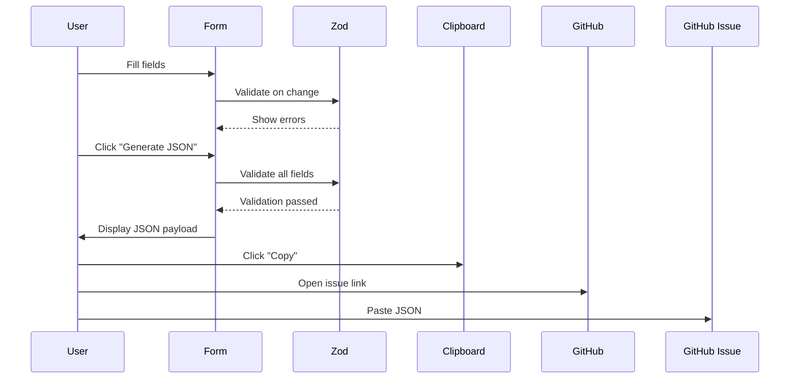
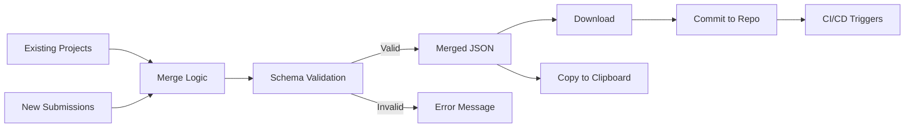
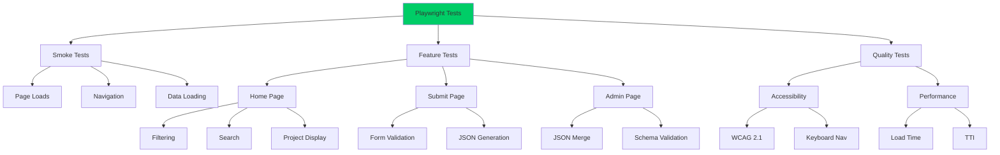
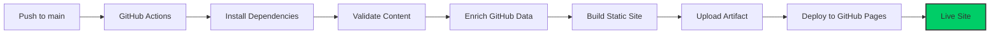

# GoCortex Showcase

A static site for showcasing Palo Alto Networks Cortex ecosystem projects with GitHub integration and administrative tools.

[](https://github.com/[username]/pilot-gocortexio-showcase/actions)
[](https://github.com/[username]/pilot-gocortexio-showcase/actions)

**Live Site:** `https://[username].github.io/[repo-name]/`

---

## Table of Contents

- [Overview](#overview)
- [Architecture](#architecture)
- [Directory Structure](#directory-structure)
- [Page Routes](#page-routes)
- [Getting Started](#getting-started)
- [Development](#development)
- [Testing](#testing)
- [Deployment](#deployment)
- [Project Submission](#project-submission)
- [Contributing](#contributing)

---

## Overview

**GoCortex Showcase** is a pure client-side static site that displays a curated collection of Cortex ecosystem projects. The site features:

- 🎨 **Modern UI** - Cyberpunk-themed design with Tailwind CSS
- 🔍 **Advanced Filtering** - Search by product, theatre, author, usecase, and period
- 📊 **GitHub Integration** - Live GitHub stats (stars, forks, last updated)
- 📝 **Project Submission** - Form-based submission workflow
- 🛠️ **Admin Tools** - JSON merge utility for managing projects
- ✅ **Comprehensive Testing** - 65+ Playwright tests
- 🚀 **GitHub Pages Deployment** - Automatic CI/CD pipeline

---

## Architecture

### Tech Stack



### Data Flow



### Application Architecture



---

## Directory Structure

```
pilot-gocortexio-showcase/
├── .github/
│   └── workflows/
│       ├── deploy.yaml              # GitHub Pages deployment
│       ├── test.yaml                # Playwright tests
│       └── verify-dev-server.yaml   # Dev server verification
│
├── client/                          # Frontend application root
│   ├── public/                      # Static assets
│   │   ├── projects.json            # ⭐ Project database (source of truth)
│   │   ├── opengraph.png            # Social media preview
│   │   └── favicon.png              # Site favicon
│   │
│   ├── src/
│   │   ├── pages/                   # Route components
│   │   │   ├── home.tsx             # / - Main showcase
│   │   │   ├── submit.tsx           # /submit - Project submission
│   │   │   ├── admin.tsx            # /admin - JSON merge utility
│   │   │   └── not-found.tsx        # /* - 404 page
│   │   │
│   │   ├── components/
│   │   │   ├── layout.tsx           # Global layout wrapper
│   │   │   ├── filter-bar.tsx       # Advanced filtering UI
│   │   │   ├── project-card.tsx     # Project display card
│   │   │   └── ui/                  # 40+ shadcn/ui components
│   │   │       ├── button.tsx
│   │   │       ├── card.tsx
│   │   │       ├── dialog.tsx
│   │   │       └── ... (37+ more)
│   │   │
│   │   ├── hooks/
│   │   │   ├── use-toast.tsx        # Toast notifications
│   │   │   └── use-mobile.tsx       # Mobile detection
│   │   │
│   │   ├── lib/
│   │   │   ├── types.ts             # ⭐ Zod schemas & TypeScript types
│   │   │   ├── queryClient.ts       # TanStack Query config
│   │   │   └── utils.ts             # Utility functions (cn, etc.)
│   │   │
│   │   ├── App.tsx                  # ⭐ Router setup
│   │   ├── main.tsx                 # React entry point
│   │   └── index.css                # ⭐ Global styles & theme
│   │
│   └── index.html                   # HTML entry point
│
├── scripts/                         # Build-time scripts
│   ├── validate.ts                  # Content safety & dead link checks
│   └── enrich.ts                    # GitHub API data enrichment
│
├── tests/                           # Playwright E2E tests
│   ├── smoke.spec.ts                # Critical path (@smoke)
│   ├── home.spec.ts                 # Home page & filtering
│   ├── submit.spec.ts               # Form validation
│   ├── admin.spec.ts                # JSON merge utility
│   ├── accessibility.spec.ts        # A11y compliance
│   ├── performance.spec.ts          # Performance metrics
│   └── README.md                    # Testing guide
│
├── Dockerfile                       # Docker build config
├── nginx.conf                       # Nginx static hosting
├── vite.config.ts                   # ⭐ Vite build config
├── playwright.config.ts             # Playwright test config
├── tsconfig.json                    # TypeScript config
├── tailwind.config.js               # Tailwind CSS config
├── package.json                     # Dependencies & scripts
│
├── CLAUDE.md                        # AI assistant guide
├── BACKEND_ARCHITECTURE.md          # Backend implementation guide
├── DEV_SERVER_SETUP.md              # Dev server verification
├── IMPLEMENTATION_SUMMARY.md        # Recent changes summary
└── README.md                        # This file

⭐ = Critical files for understanding the project
```

### Key Directories Explained

| Directory | Purpose | Key Files |
|-----------|---------|-----------|
| `client/src/pages/` | Route components (one per URL) | `home.tsx`, `submit.tsx`, `admin.tsx` |
| `client/src/components/` | Reusable UI components | `filter-bar.tsx`, `project-card.tsx` |
| `client/src/components/ui/` | shadcn/ui primitives | 40+ components |
| `client/src/lib/` | Types, schemas, utilities | `types.ts` (Zod schemas) |
| `client/public/` | Static assets | `projects.json` (database) |
| `scripts/` | Build-time utilities | `validate.ts`, `enrich.ts` |
| `tests/` | Playwright test suites | 6 test files |
| `.github/workflows/` | CI/CD pipelines | `deploy.yaml`, `test.yaml` |

---

## Page Routes

### Route Mapping

```mermaid
graph LR
    A[/ Root] --> B[home.tsx]
    C[/submit] --> D[submit.tsx]
    E[/admin] --> F[admin.tsx]
    G[/* 404] --> H[not-found.tsx]

    B --> I[FilterBar Component]
    B --> J[ProjectCard Component]
    B --> K[Layout Component]

    D --> L[React Hook Form]
    D --> M[Zod Validation]

    F --> N[JSON Editor Panels]
    F --> O[Merge Logic]

    style B fill:#4CAF50
    style D fill:#2196F3
    style F fill:#FF9800
    style H fill:#F44336
```

### Page Details

#### 1. **Home** (`/`) - `client/src/pages/home.tsx`
**Purpose:** Main project showcase with advanced filtering

**Features:**
- Grid of project cards with animations
- Search bar (fuzzy search across name, description, author)
- 5 filter dropdowns:
  - Product (Cortex XSIAM, XDR, XSOAR, Prisma Cloud, Strata)
  - Theatre (NAM, JAPAC, EMEA, LATAM, Global)
  - Author (dynamic list)
  - Usecase (dynamic list)
  - Period (filter by date range)
- Loading states
- Empty/no results states
- GitHub stats display (stars, forks, last updated)

**Data Flow:**
```
projects.json → TanStack Query → useState → FilterBar + ProjectCard Grid
```

**Components Used:**
- `<FilterBar />` - Advanced filtering UI
- `<ProjectCard />` - Individual project display
- `<Layout />` - Header/footer wrapper

---

#### 2. **Submit** (`/submit`) - `client/src/pages/submit.tsx`
**Purpose:** Project submission form with JSON generation

**Features:**
- Multi-field form (React Hook Form + Zod)
- Required fields: name, description, link, author, language
- Optional fields: repo, product, theatre, usecase, status
- Real-time validation
- JSON payload generation
- Copy to clipboard
- Opens GitHub Issue with payload

**Form Flow:**


**Validation Rules:**
- Name: Required, min 1 char
- Description: Required, min 10 chars
- Link: Required, valid URL
- Repo: Optional, format `owner/repo`
- Date: Auto-filled with current date (YYYY-MM-DD)

---

#### 3. **Admin** (`/admin`) - `client/src/pages/admin.tsx`
**Purpose:** JSON merge utility for managing project submissions

**Features:**
- Two-panel JSON editor
- Panel 1: Existing projects (from `projects.json`)
- Panel 2: New projects (paste submission JSON)
- Merge button (combines arrays, validates schema)
- Download merged JSON
- Copy merged JSON to clipboard
- No authentication (client-side only)

**Workflow:**


**Validation:**
- JSON syntax check
- Zod schema validation
- Duplicate detection (by name)
- Required fields enforcement

---

#### 4. **404 Not Found** (`/*`) - `client/src/pages/not-found.tsx`
**Purpose:** Error page for invalid routes

**Features:**
- "404 - Page Not Found" message
- Link back to home page
- Simple design consistent with theme

---

## Getting Started

### Prerequisites

- **Node.js** 20+ (LTS recommended)
- **npm** 9+ (comes with Node.js)
- **Git** (for cloning)

### Installation

```bash
# Clone repository
git clone https://github.com/[username]/pilot-gocortexio-showcase.git
cd pilot-gocortexio-showcase

# Install dependencies
npm install

# Install Playwright browsers (for testing)
npx playwright install
```

### Quick Start

```bash
# Start development server
npm run dev:client

# Open browser to http://localhost:5173
```

You should see the GoCortex Showcase homepage with project cards.

---

## Development

### Commands

```bash
# Development
npm run dev:client          # Start Vite dev server on port 5173

# Type Checking
npm run check               # Run TypeScript compiler check

# Testing
npm test                    # Run all Playwright tests
npm run test:ui             # Run tests with UI mode (recommended)
npm run test:smoke          # Run smoke tests only (fast)
npm run test:headed         # Run tests in headed mode
npm run test:debug          # Debug tests

# Production Build
npm run build               # Build static site

# Build Scripts (CI/CD only)
npx tsx scripts/validate.ts # Content safety + dead link checks
npx tsx scripts/enrich.ts   # Fetch GitHub API stats (requires GITHUB_TOKEN)
```

### Development Workflow

1. **Make changes** to files in `client/src/`
2. **Hot reload** happens automatically
3. **Run tests** with `npm run test:smoke`
4. **Commit changes** to trigger CI/CD

### Adding a New Project

#### Option 1: Via Submit Page (Recommended)
1. Navigate to `/submit`
2. Fill out the form
3. Click "Generate JSON"
4. Copy the JSON payload
5. Create a GitHub Issue with the payload
6. Admin reviews and merges via `/admin` page

#### Option 2: Manual Edit
1. Edit `client/public/projects.json`
2. Add your project to the array
3. Ensure it matches the schema (see `client/src/lib/types.ts`)
4. Commit and push

**Project Schema:**
```typescript
{
  name: string;              // Required
  description: string;       // Required, min 10 chars
  status: "active" | "development" | "beta" | "deprecated";
  link: string;              // Required, valid URL
  language: string;          // Required
  repo?: string;             // Optional, "owner/repo" format
  githubApi: boolean;        // Enable GitHub API enrichment
  product?: "Cortex XSIAM" | "Cortex XDR" | "Cortex XSOAR" | "Prisma Cloud" | "Strata";
  author: string;            // Required
  theatre?: "NAM" | "JAPAC" | "EMEA" | "LATAM" | "Global";
  usecase?: string;
  date: string;              // YYYY-MM-DD format
  media?: {
    type: "image" | "youtube";
    url: string;
    alt: string;
  };
}
```

### Modifying the UI

#### Update a Page
1. Edit `client/src/pages/[page-name].tsx`
2. Save and see changes in browser

#### Add a Component
1. Create `client/src/components/my-component.tsx`
2. Import in page: `import MyComponent from '@/components/my-component'`
3. Use: `<MyComponent />`

#### Update Styles
- Global styles: `client/src/index.css`
- Component styles: Tailwind classes in JSX
- Theme variables: `:root` in `client/src/index.css`

---

## Testing

### Test Suite Overview



### Running Tests

```bash
# Quick smoke test (< 2 minutes)
npm run test:smoke

# Full test suite (< 10 minutes)
npm test

# Interactive UI mode (recommended for debugging)
npm run test:ui

# Specific test file
npx playwright test tests/home.spec.ts

# Specific browser
npx playwright test --project=chromium
```

### Test Coverage

- **6 test suites** - `smoke`, `home`, `submit`, `admin`, `accessibility`, `performance`
- **65+ individual tests**
- **5 browsers** - Desktop Chrome, Firefox, Safari, Mobile Chrome, Mobile Safari
- **Quality gates** - A11y, performance, form validation, cross-browser

See [tests/README.md](tests/README.md) for detailed testing guide.

---

## Deployment

### GitHub Pages (Current)

**Automatic deployment** on push to `main` branch.

**Workflow:** `.github/workflows/deploy.yaml`



**Steps:**
1. ✅ **Validate** - Content safety check + dead link detection
2. ✅ **Enrich** - Fetch GitHub API stats (stars, forks, etc.)
3. ✅ **Build** - `vite build --base /$REPO_NAME/`
4. ✅ **Deploy** - Upload to GitHub Pages

**Configuration:**
- **Repository Settings** → **Pages** → **Source**: GitHub Actions
- **Custom domain**: Optional (configure in repo settings)
- **Base path**: Automatically set to `/$REPO_NAME/`

**Access your site:**
```
https://[username].github.io/[repo-name]/
```

### Alternative Deployments

#### Docker (Self-hosted)
```bash
# Build image
docker build -t gocortex-showcase .

# Run container
docker run -p 8080:80 gocortex-showcase

# Access at http://localhost:8080
```

See [Dockerfile](Dockerfile) and [BACKEND_ARCHITECTURE.md](BACKEND_ARCHITECTURE.md) for details.

#### Vercel / Netlify
1. Import repository
2. Build command: `npm run build`
3. Output directory: `dist/public`
4. Deploy

---

## Project Submission

### For Contributors

Want to add your Cortex project to the showcase?

#### Step 1: Prepare Your Project
Ensure your project:
- ✅ Is related to Palo Alto Networks Cortex ecosystem
- ✅ Has a public GitHub repository (recommended)
- ✅ Has a clear description (min 10 characters)
- ✅ Is safe for work (content safety checks enabled)

#### Step 2: Submit via Form
1. Go to `/submit` page
2. Fill in required fields:
   - **Project Name** - Official name
   - **Description** - What does it do? (min 10 chars)
   - **Link** - Project URL or repo
   - **Author** - Your name or team
   - **Language** - Primary programming language
3. Fill in optional fields:
   - **GitHub Repo** - `owner/repo` format (enables live stats)
   - **Product** - Which Cortex product?
   - **Theatre** - Geographic region
   - **Usecase** - What problem does it solve?
   - **Status** - Development stage
4. Click "Generate JSON"
5. Copy the JSON payload
6. Click "Open GitHub Issue"
7. Paste JSON into issue

#### Step 3: Wait for Review
- Admin reviews submission
- If approved, merged via `/admin` page
- Site automatically rebuilds and deploys
- Your project appears on the showcase!

### For Admins

#### Reviewing Submissions
1. Check GitHub Issues for new submissions
2. Verify JSON is valid
3. Check for appropriate content
4. Review GitHub repo (if provided)

#### Merging Submissions
1. Go to `/admin` page
2. Panel 1 shows existing projects (auto-loaded from `projects.json`)
3. Copy submission JSON from issue
4. Paste into Panel 2
5. Click "Merge"
6. Verify merged output
7. Click "Download" or "Copy"
8. Commit `projects.json` to repository
9. CI/CD automatically deploys updated site

---

## Contributing

### Development Setup
1. Fork the repository
2. Clone your fork
3. Create a feature branch: `git checkout -b feature/my-feature`
4. Make changes
5. Run tests: `npm run test:smoke`
6. Commit: `git commit -m "feat: add my feature"`
7. Push: `git push origin feature/my-feature`
8. Create Pull Request

### Code Style
- **TypeScript** - Strict mode enabled
- **ESLint** - Auto-formatting on save (recommended)
- **Tailwind CSS** - Utility-first approach
- **Component Structure** - Functional components with hooks

### Testing Requirements
- ✅ All smoke tests must pass
- ✅ Add tests for new features
- ✅ Maintain accessibility standards
- ✅ No console errors

### Commit Convention
- `feat:` - New feature
- `fix:` - Bug fix
- `docs:` - Documentation changes
- `style:` - Code style changes (formatting)
- `refactor:` - Code refactoring
- `test:` - Adding or updating tests
- `chore:` - Build process or tooling changes

---

## Configuration Files

### Key Configuration

| File | Purpose |
|------|---------|
| `vite.config.ts` | Vite build configuration, aliases, plugins |
| `tsconfig.json` | TypeScript compiler options |
| `playwright.config.ts` | Playwright test configuration |
| `tailwind.config.js` | Tailwind CSS customization |
| `package.json` | Dependencies, scripts, project metadata |
| `.github/workflows/deploy.yaml` | GitHub Pages deployment workflow |
| `.github/workflows/test.yaml` | Playwright test workflow |

### Environment Variables

**Build Time:**
- `GITHUB_TOKEN` - Required for GitHub API enrichment (auto-provided in CI/CD)
- `BASE_URL` - Optional, for Playwright tests (default: `http://localhost:5173`)

**No Runtime Environment Variables** - This is a static site

---

## Troubleshooting

### Common Issues

#### Port 5173 Already in Use
```bash
# Kill process on port 5173
lsof -ti:5173 | xargs kill

# Or use a different port
npm run dev:client -- --port 3000
```

#### Tests Failing
```bash
# Re-install Playwright browsers
npx playwright install --with-deps

# Run with debug mode
npm run test:debug

# Check dev server is running
curl http://localhost:5173
```

#### Build Failing
```bash
# Clear cache and rebuild
rm -rf node_modules dist
npm install
npm run build
```

#### GitHub Pages Not Updating
1. Check GitHub Actions workflow logs
2. Verify deployment succeeded
3. Clear browser cache
4. Wait 1-2 minutes for CDN propagation

---

## Resources

### Documentation
- [CLAUDE.md](CLAUDE.md) - AI assistant guide for development
- [BACKEND_ARCHITECTURE.md](BACKEND_ARCHITECTURE.md) - Backend implementation guide
- [DEV_SERVER_SETUP.md](DEV_SERVER_SETUP.md) - Dev server verification
- [tests/README.md](tests/README.md) - Testing guide
- [IMPLEMENTATION_SUMMARY.md](IMPLEMENTATION_SUMMARY.md) - Recent changes

### External Links
- [Vite Documentation](https://vite.dev/)
- [React Documentation](https://react.dev/)
- [Tailwind CSS](https://tailwindcss.com/)
- [Playwright](https://playwright.dev/)
- [shadcn/ui](https://ui.shadcn.com/)

---

## License

MIT License - See [LICENSE](LICENSE) file for details

---

## Support

- **Issues**: [GitHub Issues](https://github.com/[username]/pilot-gocortexio-showcase/issues)
- **Discussions**: [GitHub Discussions](https://github.com/[username]/pilot-gocortexio-showcase/discussions)
- **Pull Requests**: [GitHub PRs](https://github.com/[username]/pilot-gocortexio-showcase/pulls)

---

**Built with ❤️ for the Palo Alto Networks Cortex community**
